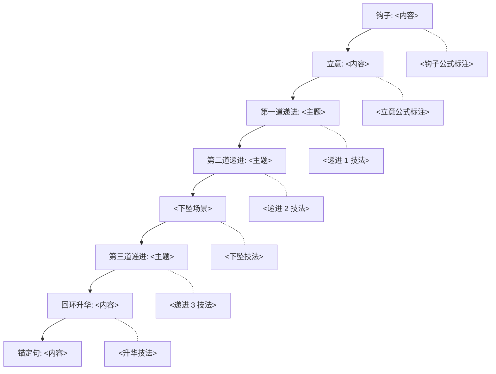

# 脚本正文模板（Script Template）

> **直接复制此文件** → 改名 `<项目名>-script.md` → 按模板填空。
> 配 [`assets/proposal-template.md`](../assets/proposal-template.md) 使用：先出 3 套方案，再选定深化。

---

## 项目信息

| 字段 | 内容 |
|------|------|
| 主题 | <待填> |
| 时长 | <10 分钟（默认）> |
| 选定方案 | <方案 A / B / C> |
| 风格 | <星球所（默认）> |
| 制作日期 | <YYYY-MM-DD> |

---

## 一句话锚定（20-50 字）

> [一句话命题，整个脚本的"经典理念"]

---

## 五阶段情绪弧线

| 阶段 | 时长 | 情绪目标 | 关键技法 |
|------|------|---------|---------|
| 上扬 | 0-15% | <好奇 / 敬畏> | <画面 / 数字> |
| 发展 | 15-35% | <引入冲突> | <对比 / 细节> |
| 下坠 | 35-55% | <危机 / 反转> | <静默 / 惊讶> |
| 回升 | 55-80% | <希望 / 方案> | <数据 / 行动> |
| 绵长 | 80-100% | <留白 / 升华> | <诗意 / 回环> |

---

## 三连接规则

**技术连接**：<具体内容>

**物理连接**：<具体内容>

**人物连接**：<具体内容 + ≥2 真实人物>

---

## 完整文案正文

### 【钩子】0:00-0:30（约 200 字）

> [在此处写钩子段落]
>
> 钩子类型：<数字震撼 / 反常识 / 问题驱动 / 画面驱动 / 故事 / 议题>
> 公式编号：[references/hook-formulas.md #X]

**画面**：<镜头语言>

**声音**：<BGM + 音效 + 旁白节奏>

---

### 【立意】0:30-1:30（约 400 字）

> [在此处建立核心命题]
>
> 命题类型：<时间尺度 / 空间跨度 / 反转 / 隐喻>

**画面**：<镜头语言>

**声音**：<BGM + 音效 + 旁白节奏>

---

### 【第一道递进：<主题>】1:30-3:30（约 700 字）

> [在此处展开第一道递进]
>
> 递进类型：<因果链 / 时空压缩 / 自然→人文 / 微观→宏观>

**画面**：<镜头语言>

**声音**：<BGM + 音效 + 旁白节奏>

**因果链关键词**：<≥3 个"因为-所以"或"导致 / 因此 / 于是">

---

### 【第二道递进：<主题>】3:30-6:00（约 900 字）

> [在此处展开第二道递进，包含下坠场景]
>
> 下坠时刻：<具体段落 + 静默 / 反转 / 惊讶>

**画面**：<镜头语言>

**声音**：<BGM + 音效 + 旁白节奏（紧张时刻）>

**人物出场**：<姓名 + 场景 + 行动 + 引述>

---

### 【第三道递进：<主题>】6:00-8:30（约 900 字）

> [在此处展开第三道递进，给出解决方案]
>
> 解决方案：<技术 / 工程 / 政策 / 人物行动>

**画面**：<镜头语言>

**声音**：<BGM + 音效 + 旁白节奏（希望 + 动能）>

**金句**：<1-2 句可截图金句>

---

### 【回环升华】8:30-9:30（约 400 字）

> [在此处升华 + 回环开头]
>
> 回环关键词：<与开头的画面 / 数字 / 命题呼应>

**画面**：<镜头语言>

**声音**：<BGM + 音效 + 旁白节奏（缓慢下降）>

**金句**：<1 句锚定句>

---

### 【致谢】9:30-10:00（约 150 字）

> [在此处致谢（数据来源 / 顾问 / 出镜人 / 客户）]

---

## 锚定句（最后 30 秒）

> [锚定句内容，20-50 字，可截图转发]

---

## 拍摄地点优先级

| 优先级 | 地点 | 关键镜头 | 拍摄难度 |
|--------|------|---------|---------|
| P0 | | | |
| P1 | | | |
| P2 | | | |
| P3 | | | |

---

## 音乐与声音设计

| 段落 | BGM 方向 | 关键音效 |
|------|---------|---------|
| 钩子 | | |
| 立意 | | |
| 第一道递进 | | |
| 第二道递进 | | |
| 第三道递进 | | |
| 回环升华 | | |

---

## 旁白 / 声音风格

- **节奏**：<每分钟 X 字，10 分钟视频约 2200-2500 字>
- **语气**：<克制 / 紧张 / 温暖>
- **关键停顿**：<金句前后留 X 秒>
- **情感音域**：<中低音域为主>

---

## 视觉 / 动画设计

- 风格参考：<参考作品>
- 关键视觉隐喻：<隐喻>
- 转场技法：<转场>

---

## 叙事模型图（Mermaid）

---

## 量化质量门自查（10 项）

> 完成正文后，逐项打分。

- [ ] **钩子质量**：[ ]/10 — 公式编号、长度、吸引力
- [ ] **因果链**：[ ]/10 — 每道递进 ≥3 个因果关键词
- [ ] **三连接**：[ ]/10 — 3 层次都填满
- [ ] **金句密度**：[ ]/10 — 每 2 分钟 ≥1 句
- [ ] **一句话锚定**：[ ]/10 — 20-50 字，含动词 + 情感锚
- [ ] **桢公子适配**：[ ]/10 — 长句占比 ≤30%，每分钟 200-250 字
- [ ] **数据来源**：[ ]/10 — ≥80% 数据带权威来源
- [ ] **人物出场**：[ ]/10 — ≥2 个真实人物
- [ ] **情绪曲线**：[ ]/10 — 2 高 + 1 低 + 结尾缓慢下降
- [ ] **回环升华**：[ ]/10 — 结尾呼应开头

**总分**：[ ]/100

---

## 一票否决项自查（10 条）

- [ ] 核心数据错误
- [ ] 史实错误
- [ ] 抄袭 / 洗稿
- [ ] 政治敏感
- [ ] 价值观偏离
- [ ] 伪科学
- [ ] 立意不清晰
- [ ] 画面与文字脱节
- [ ] 商务擦边
- [ ] 钩子与正文无关

**触发项数**：[ ]

---

## 参考来源

- <来源 1>
- <来源 2>
- <来源 3>

---

_模板 v3.0.0 · 2026-06-17_
