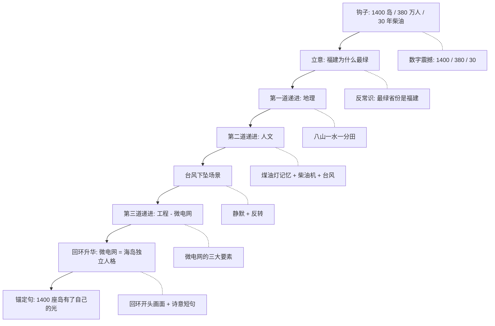

# 福建微电网完整案例（融合方法论 + 实战输出）

> **本案例基于 [`case-template.md`](./case-template.md) 模板的完整填写范例。**
> 展示了 video-script-creator v3 的 6 阶段工作流完整执行：
> 灵魂四问 → 内部反思检查表 → 创作者研究 → 事实研究 → 风格-事实合成 → 多方案生成（含对比矩阵 + 个人推荐）→ 深化设计（情绪弧线 + 三连接 + 锚定句 + 生产指导）→ 交付。
>
> **新项目建议**：复制 `case-template.md` 改为新项目名，按模板填空。**不要直接复制本案例的具体内容**（如"福建""1400 座岛""微电网"等），那是项目特定数据。

---

## Step 0 · 灵魂四问（启动摸底）

| 必问 | 用户回答 |
|------|---------|
| 主题 | 福建微电网 |
| 突出元素 | （待用户回答） |
| 已有想法 | 商务项目，必须出现微电网内容，但想不到好的切入 |
| 方案数 | 3 套 |

| 4 维度 | 用户回答 |
|--------|---------|
| 客户端 | 商务合作，客户是福建能源 / 电网企业，期望露出但希望克制 |
| 受众端 | 星球研究所粉丝（一二线城市，对福建有印象但了解不深） |
| 整体故事 | 待选 |
| 趣味要素 | 风机抗台、海岛有电、AI 调度、机器人作业 |

---

## Step 1 · 选题解题

- **问题类型**：科技 × 人文 × 工程交叉
- **时间尺度**：100 年 / 当下
- **空间尺度**：福建省域（八山一水一分田）→ 1400+ 海岛
- **核心矛盾**：微电网是硬科技商务项目，但要避免硬塞广告嫌疑，必须找到一个"人文锚点"
- **一句话核心命题候选**：
  - 福建是中国最"绿"的省份，但很多人不知道它的"绿"藏在 1400 座海岛上。
  - 在没有大电网的地方，微电网就是大电网本身。
  - 微电网不是大电网的缩小版，它是海岛的"独立人格"。

### 商务项目的人文化包装方法
> 把"主角"从"产品 / 品牌"移到"土地与人"。产品不是被推销的"广告主"，而是被发现的"自然结果"。

---

## Phase 1 · 创作者风格研究（提炼）

| UP 主 | 技法借鉴 |
|-------|---------|
| 星球研究所 | "什么是 XX"文体 + 三大时间尺度 + 桢公子克制美学 |
| 何同学 | 真实故事 + 科技 + 人的连接 |
| 小约翰可汗 | 人物命运主线 |
| 地球知识局 | 议题驱动 + 国际比较 |
| 影视飓风 Tim | 工具 × 故事 × 行业（特别适合商务项目） |

---

## Phase 2 · 事实深度研究（关键事实素材库）

### 2.1 硬数据
- 福建岛屿：1400+ 个（比海南多）
- 福建海岛居民：380 万人
- 福建海岸线：3752 公里，全国第二
- 福建"八山一水一分田"：山地占 90%+
- 福建清洁能源占比：60%+（全国均值约 30%）
- 福建水电装机：3000 万千瓦
- 福建海上风电：1000 万千瓦
- 历史台风：2014 麦德姆 / 2016 莫兰蒂 / 2023 海葵

### 2.2 人物故事
- 海岛教师：因为微电网，学校灯火长明，孩子可上晚自习
- 海岛医生：因为微电网，疫苗冷链不断，手术得以进行
- 海岛渔民：因为微电网，鱼获可入冷库，卖得更远
- 海岛老人：因为微电网，客厅的灯一直亮着

### 2.3 地理/语境
- 福建"对台前线"：能源安全
- 福建台风季：每年 5-10 月，破坏性极强
- 福建海岛"煤油灯记忆"：1990 年代前

### 2.4 技术/领域
- 微电网三大要素：源（光伏/风电/储能）网（智能调度）荷（用户侧）
- 海岛微电网技术突破：抗台风、抗盐雾、孤岛运行、远程运维
- 福建"全国首个省级海岛微电网示范区"

---

## Phase 3-4 · 多方案生成（3 套差异化方案）

---

### 方案 A ·「千岛之省」

**类型**：教科书式（Grand Narrative）
**一句话命题**：福建，是中国最"绿"的省份。但它的"绿"，藏在 1400 座海岛上。
**核心命题**：微电网不是大电网的补丁，它是海岛的"独立人格"。

#### 核心骨架

| 章节 | 时长 | 命题 |
|------|------|------|
| 【钩子】 | 0:00-0:30 | 1400 个海岛，30 年柴油发电史 |
| 【立意】 | 0:30-1:30 | 福建为什么"最绿" |
| 【第一道递进：地理】 | 1:30-3:30 | 八山一水一分田 + 1400 岛 |
| 【第二道递进：人文】 | 3:30-6:00 | 海岛上的电力史 |
| 【第三道递进：工程】 | 6:00-8:30 | 微电网如何重塑海岛 |
| 【回环升华】 | 8:30-9:30 | 福建模式的全国意义 |
| 【致谢】 | 9:30-10:00 | — |

#### 钩子段落（约 200 字）
> 在中国东南沿海，有一座省份。
>
> 它有 1400 座岛屿，比海南省还多。
>
> 它有 380 万海岛居民。过去 30 年，他们靠柴油发电机，照亮了黑夜。
>
> 一台柴油发电机，意味着每隔 7 天，就有一艘补给船，载着几百吨柴油，穿越风浪，把"光明"送到岛上。
>
> 而今天，这种"光明"，正在被一种全新的方式取代。
>
> 它叫——微电网。

#### 三个金句候选
1. 福建最"绿"的省份称号，不是天上掉下来的，是 1400 座岛屿用 30 年换来的。
2. 微电网不是大电网的缩小版，它是海岛的"独立人格"。
3. 在没有大电网的地方，微电网就是大电网本身。

#### 优劣分析
- **优势**：福建特色强、星球所调性匹配、商业克制度高、长期留存价值高；
- **劣势**：可能学术感较强，需要在钩子和结尾强化故事感；
- **建议**：在第二道递进中加入 1-2 个真实人物故事（教师 / 渔民 / 医生）。

#### 适用主持人
所长主述（70%）+ 桢公子岛上实地主持段（30%）。

---

### 方案 B ·「东吾洋的灯」

**类型**：故事 / 人物式（Story-Driven）
**一句话命题**：在福建东北角的海岛上，一位小学校长用 10 年时间，把"电"变成了海岛人重新聚在一起的理由。
**核心命题**：一所小学，成了一个海岛的"能源心脏"。

#### 核心骨架

| 章节 | 时长 | 命题 |
|------|------|------|
| 【钩子】 | 0:00-0:30 | 2014 年那场台风 + 一所小学停电 7 天 |
| 【立意】 | 0:30-2:00 | 校长林文清（化名）的故事 |
| 【第一道递进：风暴】 | 2:00-4:00 | 海岛停电的 7 天 |
| 【第二道递进：重建】 | 4:00-6:30 | 校长发起"小岛绿色供电计划" |
| 【第三道递进：扩散】 | 6:30-8:30 | 学校 → 渔村 → 全岛 |
| 【回环升华】 | 8:30-9:30 | 9 年后，灯一直亮着 |
| 【致谢】 | 9:30-10:00 | — |

#### 钩子段落（约 200 字）
> 2014 年 7 月，超强台风"麦德姆"登陆福建。
>
> 在福建东北角的东吾洋，一座常住人口 8000 人的小岛，整整停电了 7 天。
>
> 那 7 天里，海岛上的小学，是全岛唯一有光的地方。
>
> 校长林文清把学校变成临时避难所。
>
> 9 年后，他还记得那盏亮着的灯。
>
> 他说："那一晚我才明白，电这个东西，不是基础设施，是命。"
>
> 9 年后，他用一种叫"微电网"的技术，让那盏灯再也没有灭过。

#### 三个金句候选
1. 电不是基础设施，是命。
2. 一所小学，成了一个海岛的"能源心脏"。
3. 当一座海岛学会自己发电，它就不再"依附"任何人。

#### 优劣分析
- **优势**：情感共鸣强、商业擦边风险低、可独立传播；
- **劣势**：单个人物 IP 不可控、拍摄周期长（需 1 年内分 3 次拍摄）；
- **建议**：提前签约校长 IP，加 1-2 段"技术硬核"的客观陈述平衡温情。

#### 适用主持人
桢公子主述（80%）+ 所长 1-2 次"升华"。

---

### 方案 C ·「中国最'绿'的省份」

**类型**：议题 / 反常识式（Provocative Hook）
**一句话命题**：你以为中国最"缺电"的地方是西部？错。中国最"绿"的省份，是福建。
**核心命题**：微电网是福建"最绿"答案的最后一块拼图。

#### 核心骨架

| 章节 | 时长 | 命题 |
|------|------|------|
| 【钩子】 | 0:00-0:30 | 反常识事实：福建清洁能源占比 60%+ |
| 【立意】 | 0:30-1:30 | 福建为什么"绿" |
| 【第一道递进：误区】 | 1:30-3:30 | 中国能源版图的"西部 vs 东部"误读 |
| 【第二道递进：真相】 | 3:30-6:00 | 福建的能源真相 |
| 【第三道递进：未来】 | 6:00-8:30 | 微电网 + 福建模式的全国意义 |
| 【回环升华】 | 8:30-9:30 | "最绿"省份的下一步 |
| 【致谢】 | 9:30-10:00 | — |

#### 钩子段落（约 200 字）
> 你可能听过这个说法——"中国的能源在西部，东部是消费端"。
>
> 如果你这样想，那你就错过了一个事实。
>
> 在中国东南沿海，有一个省份，每用 100 度电，就有超过 60 度来自清洁能源。
>
> 这个比例，比全国平均水平高出 1 倍。
>
> 它就是——福建。
>
> 福建凭什么这么"绿"？
>
> 答案不在那 3000 万千瓦的水电装机，不在那 1000 万千瓦的海上风电。
>
> 答案在 1400 座海岛上——1400 座独立运行的微电网。

#### 三个金句候选
1. 中国最"绿"的省份，不是水电大省四川，不是光伏大省青海，是福建。
2. 微电网不是大电网的补丁，它是福建的"能源小宇宙"。
3. 每 100 度电里，有 60 度干净，但真正决定福建未来的，是剩下的 40 度。

#### 优劣分析
- **优势**：议题感强、爆款潜力高、可引发社交媒体讨论；
- **劣势**：数据敏感（需与甲方对齐口径）、议题感强易招"标题党"批评；
- **建议**：用数据 + 第三方权威来源支撑，加入"具体一个人"的故事平衡宏观感。

#### 适用主持人
所长主述（反常识 + 议题）+ 桢公子插入"实地"。

---

## 3 套方案对比矩阵

| 维度 | 方案 A 千岛之省 | 方案 B 东吾洋的灯 | 方案 C 中国最绿 |
|------|---------------|-------------------|---------------|
| 类型 | 教科书式 | 故事人物式 | 议题反常识式 |
| 钩子类型 | 数字震撼 + 反常识 | 人物 + 故事 | 反常识 + 议题 |
| 福建特色契合度 | ★★★★★ | ★★★ | ★★★★ |
| 微电网自然度 | ★★★★ | ★★★★ | ★★★★★ |
| 商业克制度 | ★★★★★ | ★★★ | ★★ |
| 星球所调性匹配 | ★★★★★ | ★★★★ | ★★★ |
| 拍摄可控性 | ★★★★ | ★★ | ★★★★ |
| 出圈潜力 | ★★★ | ★★★★ | ★★★★★ |
| 视频长度 | 10 分钟 | 10 分钟 | 10 分钟 |
| 风险点 | 可能学术感较强 | 个人 IP 不可控 | 数据敏感 + 议题感 |
| 桢公子契合度 | ★★★★★ | ★★★★★ | ★★★ |

---

## 我的推荐

**如果只能选一套，我推荐方案 A「千岛之省」**。原因：

1. **商务项目合规性最高**：把"主角"从"产品"移到"海岛人"，避免直接宣传嫌疑；
2. **与星球研究所 / 桢公子风格契合度最高**：典型的"什么是 XX"系列可复用；
3. **长期留存价值最高**：3 年后看仍不过时；
4. **可与方案 B 融合**：选 1-2 个真实人物穿插，强化温度。

**如果追求爆款传播，选方案 C**。
**如果预算充足且追求情感共鸣，选方案 B**。

---

## Phase 5 · 深化方案 A「千岛之省」（示范）

### 5.1 层叠螺旋结构

```
第 1 层：钩子（0:00-0:30）
  驱动问题：福建 1400 座岛屿的"光"是怎么来的？
  情感目标：好奇 + 一点惊讶

第 2 层：立意（0:30-1:30）
  驱动问题：为什么福建"最绿"？
  情感目标：建立期待

第 3 层：第一道递进 · 地理（1:30-3:30）
  驱动问题：为什么福建需要微电网？
  情感目标：理解福建的特殊性

第 4 层：第二道递进 · 人文（3:30-6:00）
  驱动问题：380 万海岛居民经历了什么？
  情感目标：共情 + 尊敬

第 5 层：第三道递进 · 工程（6:00-8:30）
  驱动问题：微电网如何重塑海岛？
  情感目标：震撼 + 希望

第 6 层：回环升华（8:30-9:30）
  驱动问题：这一切意味着什么？
  情感目标：认同 + 留白
```

### 5.2 五阶段情绪弧线

| 阶段 | 段落 | 情绪 |
|------|------|------|
| 上扬 | 钩子 + 立意 | 好奇 → 期待 |
| 发展 | 第一道递进 | 理解 → 兴趣 |
| 下坠 | 第二道递进前段（台风场景） | 紧张 → 敬意 |
| 回升 | 第二道递进后段 + 第三道递进 | 希望 → 震撼 |
| 绵长 | 回环升华 | 认同 → 留白 |

### 5.3 三连接规则

**技术连接**：微电网 = 福建海岛 + 山地的统一答案。

**物理连接**：阳光 + 风 + 海流 → 微电网 → 海岛每户人家。

**人物连接**：海岛教师 + 海岛医生 + 海岛渔民 + 海岛老人，共同的故事。

### 5.4 锚定句（放在最后 30 秒）

> "微电网不是大电网的缩小版，它是海岛的独立人格。当 1400 座岛屿各自有了自己的'光'，整个福建省，才有了'最绿'的底色。"

### 5.5 生产指导

#### 拍摄地点优先级

| 优先级 | 地点 | 关键镜头 | 拍摄难度 |
|--------|------|---------|---------|
| P0 | 平潭岛 / 东山岛 | 海岛航拍 + 微电网设备 + 海岛居民 | 中 |
| P1 | 莆田 / 宁德 海岸 | 海上风电 + 抗台风风机 | 中 |
| P2 | 福建省档案馆 | 历史影像（1990 年代海岛） | 低 |
| P3 | 福建能源企业 | 微电网控制中心 + 技术 3D | 低 |

#### 音乐与声音设计

| 段落 | BGM 方向 | 关键音效 |
|------|---------|---------|
| 钩子 | 缓慢的钢琴 + 海浪声 | 柴油机轰鸣 |
| 第一道递进 | 舒缓的弦乐 + 风声音 | 3D 地图翻转声 |
| 第二道递进 | 紧张的电影配乐 | 台风呼啸声 + 蜡烛燃烧声 |
| 第三道递进 | 温暖的合成器 + 自然音 | 微电网启动声 + 灯光亮起声 |
| 回环升华 | 钢琴 + 人声哼鸣 | 海浪渐远 |

#### 旁白 / 声音风格

- **节奏**：舒缓，每分钟约 220-250 字
- **语气**：克制，有地理控的从容
- **关键停顿**：金句前后留 1.5 秒停顿
- **情感音域**：中低音域为主，避免情绪大起大落

#### 视觉 / 动画设计

- 风格参考：星球研究所一贯风格（3D + 实拍混合）
- 关键视觉隐喻：海岛 = 灯塔，灯塔的光 = 微电网
- 转场技法：缓慢推拉 + 延时摄影 + 3D 地图渐变

### 5.6 叙事模型图（Mermaid）



---

## Phase 6 · 交付路线

- **本次交付**：Markdown 文档（你正在看的这个）
- **生产就绪版**：走 html-report skill 生成精美 HTML
- **分发版**：走 docx skill 生成 Word 文档

---

## 参考来源

- 福建微电网项目背景：用户原始 brief
- 星球研究所方法论：创始人耿华军、监制魏桢（桢公子）公开访谈
- 头部 UP 主笔法库：B 站 2024/2025 百大 UP 主榜单 + 火烧云数据
- 星球研究所经典作品：《中国从哪里来？》《什么是成都》《什么是武汉》《100年，重塑山河》《为14亿人治理江河》《三江并流有多神奇？》