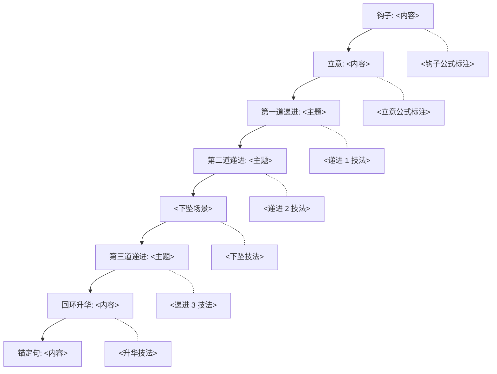

# 案例模板（Case Template）

> **这是一个空白模板**。新项目按这个结构填具体内容。
> 已填好的完整范例：[`case-fujian-microgrid.md`](./case-fujian-microgrid.md)

---

## Step 0 · 灵魂四问（启动摸底）

### 灵魂四问（必问 4 个）

| 必问 | 用户回答 |
|------|---------|
| 主题 | <待用户回答> |
| 突出元素 | <必含元素 1 / 元素 2 / 元素 3> |
| 已有想法 | <已有想法 / 商务项目 / 纯科普> |
| 方案数 + 时长 | <3 套 + 10 分钟（默认）> |

### 内部反思（撰稿人自查，不问用户）

| 4 维度 | 撰稿人反思 |
|--------|----------|
| 客户端 | <商务 / 纯科普 / 企业宣传？边界在哪？> |
| 受众端 | <目标观众是谁 / 已知道什么 / 想看什么> |
| 整体故事 | <层层递进 / 反向设问 / 时间线 / 人物代际> |
| 趣味要素 | <亮点 1 / 亮点 2 / 亮点 3> |

---

## Step 1 · 选题解题

- **问题类型**：<科技 × 人文 / 历史 × 现代 / 城市 × 乡村 / 等等>
- **时间尺度**：<6500万年 / 1万年 / 100年 / 当下>
- **空间尺度**：<全国 / 区域 / 一城一山一河>
- **核心矛盾**：<一句话说清本视频的"反常识真相"或"核心张力">
- **一句话核心命题候选**：
  - 候选 A：<10-30 字>
  - 候选 B：<10-30 字>
  - 候选 C：<10-30 字>

### 商务项目专项

> 商务项目需说明"主角"如何从产品移到土地与人。
> 产品是"自然发现的"，不是"被推销的"。

---

## Phase 1 · 创作者风格研究（提炼）

| UP 主 | 技法借鉴 |
|-------|---------|
| 星球研究所 | <克制的底色 + 三大时间尺度 + "什么是 XX"文体> |
| <Fallback 1> | <主笔法 1> |
| <Fallback 2> | <主笔法 2> |
| <反向参考> | <避免的风格> |

> 风格选择详见 [`style-fallback.md`](./style-fallback.md)。
> 完整 UP 主笔法库见 [`creator-database.md`](./creator-database.md)。

---

## Phase 2 · 事实深度研究（关键事实素材库）

### 2.1 硬数据（≥10 个）

| # | 事实 | 来源 |
|---|------|------|
| 1 | <数据点 1> | <来源> |
| 2 | <数据点 2> | <来源> |
| 3 | <数据点 3> | <来源> |
| ... | ... | ... |

### 2.2 人物故事（≥3 个）

- **<人物 A>**：<职业 + 场景 + 行动 + 一句话引述>
- **<人物 B>**：<职业 + 场景 + 行动 + 一句话引述>
- **<人物 C>**：<职业 + 场景 + 行动 + 一句话引述>

### 2.3 地理 / 语境

- <地理特色 1>
- <地理特色 2>
- <历史文化 1>
- <历史文化 2>

### 2.4 技术 / 领域

- <技术原理 1>
- <技术原理 2>
- <行业背景 1>

---

## Phase 3-4 · 多方案生成（3 套差异化方案）

---

### 方案 A ·<方案名称>

**类型**：<教科书式 / 故事人物式 / 议题反常识式>
**一句话命题**：<10-30 字>
**核心命题**：<钩子背后的"经典理念">

#### 核心骨架

| 章节 | 时长 | 命题 |
|------|------|------|
| 【钩子】 | 0:00-0:30 | <钩子命题> |
| 【立意】 | 0:30-1:30 | <立意命题> |
| 【第一道递进：<主题>】 | 1:30-3:30 | <递进 1 命题> |
| 【第二道递进：<主题>】 | 3:30-6:00 | <递进 2 命题> |
| 【第三道递进：<主题>】 | 6:00-8:30 | <递进 3 命题> |
| 【回环升华】 | 8:30-9:30 | <升华命题> |
| 【致谢】 | 9:30-10:00 | — |

#### 钩子段落（约 200 字）

> <钩子段落内容>

#### 三个金句候选

1. <金句 1>
2. <金句 2>
3. <金句 3>

#### 优劣分析

- **优势**：<契合点 / 系列感 / 商业克制度>
- **劣势**：<可能的学术感 / 拍摄成本 / 商业擦边风险>
- **建议**：<如何优化>

#### 适用主持人

<所长主述 / 桢公子主述 / 双人配置 / 其他>

---

### 方案 B ·<方案名称>

**类型**：<故事人物式>
**一句话命题**：<10-30 字>
**核心命题**：<钩子背后的"经典理念">

#### 核心骨架

| 章节 | 时长 | 命题 |
|------|------|------|
| 【钩子】 | 0:00-0:30 | <钩子命题> |
| 【立意】 | 0:30-2:00 | <立意命题> |
| 【第一道递进：风暴】 | 2:00-4:00 | <递进 1 命题> |
| 【第二道递进：重建】 | 4:00-6:30 | <递进 2 命题> |
| 【第三道递进：扩散】 | 6:30-8:30 | <递进 3 命题> |
| 【回环升华】 | 8:30-9:30 | <升华命题> |
| 【致谢】 | 9:30-10:00 | — |

#### 钩子段落（约 200 字）

> <钩子段落内容>

#### 三个金句候选

1. <金句 1>
2. <金句 2>
3. <金句 3>

#### 优劣分析

- **优势**：<情感共鸣 / 商业擦边低 / 可独立传播>
- **劣势**：<单个人物 IP 不可控 / 拍摄周期长>
- **建议**：<提前签约 IP / 加技术硬核平衡温情>

#### 适用主持人

<桢公子主述 / 所长 1-2 次"升华">

---

### 方案 C ·<方案名称>

**类型**：<议题反常识式>
**一句话命题**：<10-30 字>
**核心命题**：<钩子背后的"经典理念">

#### 核心骨架

| 章节 | 时长 | 命题 |
|------|------|------|
| 【钩子】 | 0:00-0:30 | <钩子命题> |
| 【立意】 | 0:30-1:30 | <立意命题> |
| 【第一道递进：误区】 | 1:30-3:30 | <递进 1 命题> |
| 【第二道递进：真相】 | 3:30-6:00 | <递进 2 命题> |
| 【第三道递进：未来】 | 6:00-8:30 | <递进 3 命题> |
| 【回环升华】 | 8:30-9:30 | <升华命题> |
| 【致谢】 | 9:30-10:00 | — |

#### 钩子段落（约 200 字）

> <钩子段落内容>

#### 三个金句候选

1. <金句 1>
2. <金句 2>
3. <金句 3>

#### 优劣分析

- **优势**：<议题感 / 爆款潜力 / 引发讨论>
- **劣势**：<数据敏感 / 议题感易招"标题党"批评>
- **建议**：<用数据 + 第三方权威支撑>

#### 适用主持人

<所长主述（反常识 + 议题）+ 桢公子插入"实地">

---

## 3 套方案对比矩阵

| 维度 | 方案 A | 方案 B | 方案 C |
|------|--------|--------|--------|
| 类型 | 教科书式 | 故事人物式 | 议题反常识式 |
| 钩子类型 | <类型> | <类型> | <类型> |
| <项目特色契合度> | ★ | ★ | ★ |
| <项目特色契合度> | ★ | ★ | ★ |
| 商业克制度 | ★ | ★ | ★ |
| 风格调性匹配 | ★ | ★ | ★ |
| 拍摄可控性 | ★ | ★ | ★ |
| 出圈潜力 | ★ | ★ | ★ |
| 视频长度 | 10 分钟 | 10 分钟 | 10 分钟 |
| 风险点 | <风险> | <风险> | <风险> |
| 主持人契合度 | ★ | ★ | ★ |

---

## 我的推荐

**如果只能选一套，我推荐方案 X「XXXX」**。原因：

1. **<原因 1**（最重要的一条）>
2. **<原因 2**（与项目风格的契合度）>
3. **<原因 3**（可执行性 / 商业合规性）>
4. **<原因 4**（可融合其他方案的元素）>

**如果追求 X，选方案 Y**。
**如果预算 / 风格 X，选方案 Z**。

## 接下来你想

1. 选定方案展开成完整 10 分钟脚本正文（约 2500-3500 字）
2. 融合其他方案的关键元素
3. 重做：告诉我你的反馈，我来调整

---

## Phase 5 · 深化方案 X「XXXX」（示范）

### 5.1 层叠螺旋结构

```
第 1 层：钩子（0:00-0:30）
  驱动问题：<驱动问题>
  情感目标：<情感目标>

第 2 层：立意（0:30-1:30）
  驱动问题：<驱动问题>
  情感目标：<情感目标>

第 3 层：第一道递进 · <主题>（1:30-3:30）
  驱动问题：<驱动问题>
  情感目标：<情感目标>

第 4 层：第二道递进 · <主题>（3:30-6:00）
  驱动问题：<驱动问题>
  情感目标：<情感目标>

第 5 层：第三道递进 · <主题>（6:00-8:30）
  驱动问题：<驱动问题>
  情感目标：<情感目标>

第 6 层：回环升华（8:30-9:30）
  驱动问题：<驱动问题>
  情感目标：<情感目标>
```

### 5.2 五阶段情绪弧线

| 阶段 | 段落 | 情绪 |
|------|------|------|
| 上扬 | 钩子 + 立意 | <情绪曲线> |
| 发展 | 第一道递进 | <情绪曲线> |
| 下坠 | 第二道递进前段 | <情绪曲线> |
| 回升 | 第二道递进后段 + 第三道递进 | <情绪曲线> |
| 绵长 | 回环升华 | <情绪曲线> |

### 5.3 三连接规则

**技术连接**：<具体内容>

**物理连接**：<具体内容>

**人物连接**：<具体内容 + ≥2 真实人物>

### 5.4 锚定句（放在最后 30 秒）

> <锚定句内容，20-50 字>

### 5.5 生产指导

#### 拍摄地点优先级

| 优先级 | 地点 | 关键镜头 | 拍摄难度 |
|--------|------|---------|---------|
| P0 | <地点 1> | <镜头 1> | <难度> |
| P1 | <地点 2> | <镜头 2> | <难度> |
| P2 | <地点 3> | <镜头 3> | <难度> |
| P3 | <地点 4> | <镜头 4> | <难度> |

#### 音乐与声音设计

| 段落 | BGM 方向 | 关键音效 |
|------|---------|---------|
| 钩子 | <BGM> | <音效> |
| 第一道递进 | <BGM> | <音效> |
| 第二道递进 | <BGM> | <音效> |
| 第三道递进 | <BGM> | <音效> |
| 回环升华 | <BGM> | <音效> |

#### 旁白 / 声音风格

- **节奏**：<每分钟 X 字>
- **语气**：<克制 / 紧张 / 温暖>
- **关键停顿**：<金句前后留 X 秒停顿>
- **情感音域**：<中低音域 / 高音域>

#### 视觉 / 动画设计

- 风格参考：<参考作品>
- 关键视觉隐喻：<隐喻>
- 转场技法：<转场>

### 5.6 叙事模型图（Mermaid）



---

## Phase 6 · 交付路线

- **本次交付**：Markdown 文档（你正在看的这个）
- **生产就绪版**：走 html-report skill 生成精美 HTML
- **分发版**：走 docx skill 生成 Word 文档

---

## 参考来源

- <来源 1>
- <来源 2>
- <来源 3>

---

_模板 v3.0.0 · 2026-06-17_
